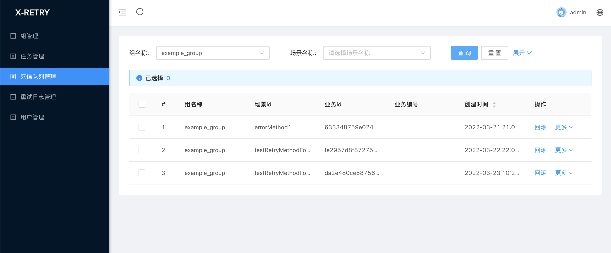
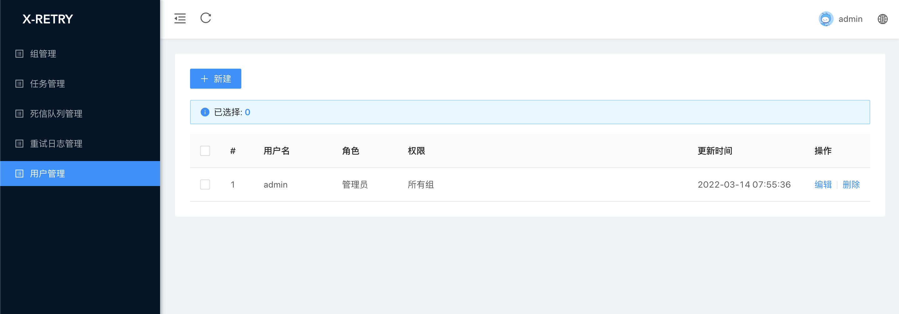

## 《分布式异常重试服务平台 X-RETRY》

# 简介
> X-RETRY 基于服务治理的思想我们开发了重试治理的功能，支持动态配置，接入方式基本无需入侵业务代码，并使用多种策略结合的方式在链路层面控制重试放大效应，兼顾易用性、灵活性、安全性的分布式异常重试服务平台

# 社区
https://www.byteblogs.com/chat

# 特性
1. 管控重试流量，预防重试风暴，及早发现和预警，并且提供流程管理手段
2. 保证易用性: 业务接入成本小。避免依赖研发人员的技术水平，保障重试的稳定性
3. 灵活性: 能够动态调整配置,启动/停止任务,以及终止运行中的重试数据
4. 操作简单:一分钟上手，支持WEB页面对重试数据CRUD操作。
5. 数据大盘: 实时管控系统重试数据。
6. 多样化退避策略: Cron、固定间隔、等级触发、随机时间触发
7. 容器化部署: 服务端支持docker容器部署
8. 高性能调度平台: 支持服务端节点动态扩容和缩容
9. 多样化重试类型: 支持ONLY_LOCAL、ONLY_REMOTE、LOCAL_REMOTE多种重试类型
10. 重试数据管理: 可以做到重试数据不丢失、重试数据一键回放
11. 支持多样化的告警方式: 邮箱、企业微信、钉钉

# 快速入门
## 添加依赖
```java
<dependency>
    <groupId>com.x.retry</groupId>
    <artifactId>x-retry-client-starter</artifactId>
    <version>0.0.0.1-SNAPSHOT</version>
</dependency>
```

## 配置
添加注解开启X-RETRY功能
```java
@SpringBootApplication
@EnableXRetry(group = "example_group")
public class ExampleApplication {

    public static void main(String[] args) {
        SpringApplication.run(ExampleApplication.class, args);
    }

}
```

为需要重试的方法添加重试注解
```java
@Retryable(scene = "errorMethodForLocalAndRemote", localTimes = 3, retryStrategy = RetryType.LOCAL_REMOTE)
    public String errorMethodForLocalAndRemote(String name) {

        double i = 1 / 0;

        return "这是一个简单的异常方法";
    }
```
## Retryable 详解
|属性|类型|必须指定|默认值|描述|
|-|-|-|-|-|
| scene |String|是|无|场景|
| include | Throwable |否|无|包含的异常|
| exclude |Throwable|否|无|排除的异常|
| retryStrategy|RetryType|是|LOCAL_REMOTE|重试策略|
| retryMethod|RetryMethod|是|RetryAnnotationMethod|重试处理入口|
| bizId | BizIdGenerate |是| SimpleBizIdGenerate |自定义业务id，默认为hash(param),传入成员列表，全部拼接取hash|
| bizNo |String|否|无| bizNo spel表达式|
| localTimes |int|是|3| 本地重试次数 次数必须大于等于1|
| localInterval |int|是|2| 本地重试间隔时间(s)|


## 配置部署服务端调度平台
### 初始化数据库
数据库脚本位置
```
doc/sql/x_retry.sql
```

### 系统配置
```yaml
spring:
  datasource:
    name: x_retry
    url:  jdbc:mysql://localhost:3306/x_retry?useSSL=false&characterEncoding=utf8&useUnicode=true
    username: root
    password: root
    type: com.zaxxer.hikari.HikariDataSource
    driver-class-name: com.mysql.jdbc.Driver
    hikari:
      connection-timeout: 30000
      minimum-idle: 5
      maximum-pool-size: 20
      auto-commit: true
      idle-timeout: 30000
      pool-name: x_retry
      max-lifetime: 1800000
      connection-test-query: SELECT 1
  resources:
    static-locations: classpath:admin/
mybatis-plus:
  mapper-locations: classpath:/mapper/*.xml
  typeAliasesPackage: com.x.retry.server.persistence.mybatis.po
  global-config:
    db-config:
      field-strategy: NOT_EMPTY
      capital-mode: false
      logic-delete-value: 1
      logic-not-delete-value: 0
  configuration:
    map-underscore-to-camel-case: true
    cache-enabled: true
x-retry:
  lastDays: 30 # 拉取重试数据的天数
  retryPullPageSize: 100 # 拉取重试数据的每批次的大小
  nettyPort: 1788  # 服务端netty端口
  totalPartition: 32  # 重试和死信表的分区总数

```

##项目部署
### 下载源码部署
- 下载源码
  ```
   https://github.com/byteblogs168/x-retry.git
  ```
  
- maven 打包镜像
```
maven clean install
```

- 修改配置
```
/x-retry-server/src/main/resources/application.yml
```
  
- 启动
```
java -jar x-retry-server.jar
```

### docker 部署
- 下载镜像
  地址:  https://github.com/byteblogs168/x-retry/pkgs/container/x-retry-server
  ```
    docker pull ghcr.io/byteblogs168/x-retry-server:{最新版本}
  ```

- 创建容器并运行

```
/**
* 如需自定义 mysql 等配置，可通过 "-e PARAMS" 指定，参数格式 PARAMS="--key1=value1  --key2=value2" ；
* 配置项参考文件：/x-retry-server/src/main/resources/application.yml
* 如需自定义 JVM内存参数 等配置，可通过 "-e JAVA_OPTS" 指定，参数格式 JAVA_OPTS="-Xmx512m" ；
*/
docker run \
  -e PARAMS="--spring.datasource.username=root --spring.datasource.password=123456  --spring.datasource.url=jdbc:mysql://ip:3306/x_retry?useUnicode=true&characterEncoding=UTF-8&autoReconnect=true&serverTimezone=Asia/Shanghai " \
  -p 8080:8080 \
  -p 1788:1788 \
  --name x-retry-server-1  \
  -d registry.cn-shanghai.aliyuncs.com/byteblogs/x-retry:{最新版本}

```

如果你已经正确按照系统了，那么你可以输入
```
http://localhost:8080
```

会出现登陆页面:


输入用户名: admin, 密码: 123456

## 组配置
通过`新建`按钮配置点开配置组、场景、通知界面


### 组配置
每个系统对应一个组，服务端通过一致性hash环来分配当前已启用的Group在集群中哪节点上消费

- 组名称: 名称是数字、字母、下划线组合，最长64个字符长度
- 状态: 开启/关闭, 通过状态开启或关闭组状态
- 路由策略: 随机算法、一致性hash算法、最近最久未使用算法
- 描述: 对组进行描述
- 指定分区: 不指定则系统随机分区，指定则使用指定的分区


### 场景配置
场景负责管理收集重试现场的数据，比如 方法名、参数、类等信息; 对照代码 中可以理解为需要重试的方法;
每个业务服务对应N个场景值，即系统配置的最小单位。

- 场景名称: 名称是数字、字母、下划线组合，最长64个字符长度
- 场景状态: 开启/关闭, 通过状态开启或关闭场合状态
- 退避策略: 延迟等级、固定时间、CRON表达式、随机等待
- 最大重试次数: 重试上限值
- 描述: 对场景进行描述
- 操作: 新增-添加场景配置、删除-未提交则删除临时场景配置，已提交则删除数据库中的场景配置


### 通知配置
及时告知系统管理人员，系统运行状态，如出现大量重试的数据、或者大量重试失败的数据

- 通知类型: 钉钉通知、邮箱通知、企业微信通知
- 通知场景: 
  - 重试数量超过阈值: 作用于服务端，重试中的数量到达阈值发送通知
  - 重试失败数量超过阈值: 作用于服务端，达到最大重试次数的数量到达阈值发送通知
  - 客户端上报失败: 作用于客户端，上报数据失败 发送 通知 
  - 客户端组件异常: 作用于客户端，重试组件内部异常，发送通知 
- 通知阈值: 到达阈值发送通知
- 通知地址: 发送通知的地址
- 描述: 对通知进行描述
- 操作: 新增-添加场景配置、删除-未提交则删除临时通知配置，已提交则删除数据库中的通知配置


### 重试列表
查询当前处理重试中的数据，存在三种状态 
- 重试中: 会一直存在重试列表中
- 最大重试次数: 重试失败次数到达最大重试次数之后，由清除线程负责迁移至死信队列列表中
- 重试完成: 重试成功之后，由清除线程负责删除重试完成的数据

支持的搜索条件:
- 组名称: 下拉选择相应的组进行精确搜索
- 场景名称: 下拉选择相应的场景进行精确搜索
- 业务编号: 根据业务编号精确搜索
- 业务id: 根据业务id精确搜索


### 重试日志列表
支持的搜索条件:
- 组名称: 下拉选择相应的组进行精确搜索
- 场景名称: 下拉选择相应的场景进行精确搜索
- 业务编号: 根据业务编号精确搜索
- 业务id: 根据业务id精确搜索


### 死信队列列表
支持的搜索条件:
- 组名称: 下拉选择相应的组进行精确搜索
- 场景名称: 下拉选择相应的场景进行精确搜索
- 业务编号: 根据业务编号精确搜索
- 业务id: 根据业务id精确搜索



### 用户列表
搜索系统用户信息
支持的搜索条件:
- 用户名: 模糊搜索用户名



### 新增用户
为系统新增用户
- 用户名: 用户名是数字、字母、下划线组合，最长64个字符长度
- 密码: 密码是数字、字母、下划线组合，最长64个字符长度
- 角色: 
  - 普通用户: 负责分配的组权限
  - 管理员: 管理所有的 组谦虚
- 权限: 需要管理的组

