## 《分布式异常重试服务平台 X-RETRY》

# 简介
> X-RETRY 基于服务治理的思想我们开发了重试治理的功能，支持动态配置，接入方式基本无需入侵业务代码，并使用多种策略结合的方式在链路层面控制重试放大效应，兼顾易用性、灵活性、安全性的分布式异常重试服务平台

# 社区
https://www.byteblogs.com/chat

# 官方QQ群
使用过程中有任何问题，或者对项目有什么想法或者建议，可以加入社群，跟群友一起交流讨论


# 特性
1. 管控重试流量，预防重试风暴，及早发现和预警，并且提供流程管理手段
2. 保证易用性: 业务接入成本小。避免依赖研发人员的技术水平，保障重试的稳定性
3. 灵活性: 能够动态调整配置,启动/停止任务,以及终止运行中的重试数据
4. 操作简单:一分钟上手，支持WEB页面对重试数据CRUD操作。
5. 数据大盘: 实时管控系统重试数据。
6. 多样化退避策略: Cron、固定间隔、等级触发、随机时间触发
7. 容器化部署: 服务端支持docker容器部署
8. 高性能调度平台: 支持服务端节点动态扩容和缩容
9. 多样化重试类型: 支持ONLY_LOCAL、ONLY_REMOTE、LOCAL_REMOTE多种重试类型
10. 重试数据管理: 可以做到重试数据不丢失、重试数据一键回放
11. 支持多样化的告警方式: 邮箱、企业微信、钉钉

# 快速入门
## 添加依赖
```java
<dependency>
    <groupId>com.x.retry</groupId>
    <artifactId>x-retry-client-starter</artifactId>
    <version>最新版本</version>
</dependency>
```

## 配置
添加注解开启X-RETRY功能
```java
@SpringBootApplication
@EnableXRetry(group = "example_group")
public class ExampleApplication {

    public static void main(String[] args) {
        SpringApplication.run(ExampleApplication.class, args);
    }

}
```

为需要重试的方法添加重试注解
```java
@Retryable(scene = "errorMethodForLocalAndRemote", localTimes = 3, retryStrategy = RetryType.LOCAL_REMOTE)
    public String errorMethodForLocalAndRemote(String name) {

        double i = 1 / 0;

        return "这是一个简单的异常方法";
    }
```

## Retryable 详解
|属性|类型|必须指定|默认值|描述|
|-|-|-|-|-|
| scene |String|是|无|场景|
| include | Throwable |否|无|包含的异常|
| exclude |Throwable|否|无|排除的异常|
| retryStrategy|RetryType|是|LOCAL_REMOTE|重试策略|
| retryMethod|RetryMethod|是|RetryAnnotationMethod|重试处理入口|
| bizId | BizIdGenerate |是| SimpleBizIdGenerate |自定义业务id，默认为hash(param),传入成员列表，全部拼接取hash|
| retryCompleteCallback | RetryCompleteCallback |否| SimpleRetryCompleteCallback |服务端重试完成(重试成功、重试到达最大次数)回调客户端|
| isThrowException|boolean|否|true| 本地重试完成后是否抛出异常 |
| bizNo |String|否|无| bizNo spel表达式|
| localTimes |int|是|3| 本地重试次数 次数必须大于等于1|
| localInterval |int|是|2| 本地重试间隔时间(s)|


## 配置部署服务端调度平台
### 初始化数据库
数据库脚本位置
```
doc/sql/x_retry.sql
```

### 系统配置
```yaml
spring:
  datasource:
    name: x_retry
    url:  jdbc:mysql://localhost:3306/x_retry?useSSL=false&characterEncoding=utf8&useUnicode=true
    username: root
    password: root
    type: com.zaxxer.hikari.HikariDataSource
    driver-class-name: com.mysql.jdbc.Driver
    hikari:
      connection-timeout: 30000
      minimum-idle: 5
      maximum-pool-size: 20
      auto-commit: true
      idle-timeout: 30000
      pool-name: x_retry
      max-lifetime: 1800000
      connection-test-query: SELECT 1
  resources:
    static-locations: classpath:admin/
mybatis-plus:
  mapper-locations: classpath:/mapper/*.xml
  typeAliasesPackage: com.x.retry.server.persistence.mybatis.po
  global-config:
    db-config:
      field-strategy: NOT_EMPTY
      capital-mode: false
      logic-delete-value: 1
      logic-not-delete-value: 0
  configuration:
    map-underscore-to-camel-case: true
    cache-enabled: true
x-retry:
  lastDays: 30 # 拉取重试数据的天数
  retryPullPageSize: 100 # 拉取重试数据的每批次的大小
  nettyPort: 1788  # 服务端netty端口
  totalPartition: 32  # 重试和死信表的分区总数

```

##项目部署
### 下载源码部署
- 下载源码
  ```
   https://github.com/byteblogs168/x-retry.git
  ```
  
- maven 打包镜像
```
maven clean install
```

- 修改配置
```
/x-retry-server/src/main/resources/application.yml
```
  
- 启动
```
java -jar x-retry-server.jar
```

### docker 部署
- 下载镜像
  地址:  https://github.com/byteblogs168/x-retry/pkgs/container/x-retry-server
  ```
    docker pull ghcr.io/byteblogs168/x-retry-server:{最新版本}
  ```

- 创建容器并运行

```
/**
* 如需自定义 mysql 等配置，可通过 "-e PARAMS" 指定，参数格式 PARAMS="--key1=value1  --key2=value2" ；
* 配置项参考文件：/x-retry-server/src/main/resources/application.yml
* 如需自定义 JVM内存参数 等配置，可通过 "-e JAVA_OPTS" 指定，参数格式 JAVA_OPTS="-Xmx512m" ；
*/
docker run \
  -e PARAMS="--spring.datasource.username=root --spring.datasource.password=123456  --spring.datasource.url=jdbc:mysql://ip:3306/x_retry?useUnicode=true&characterEncoding=UTF-8&autoReconnect=true&serverTimezone=Asia/Shanghai " \
  -p 8080:8080 \
  -p 1788:1788 \
  --name x-retry-server-1  \
  -d registry.cn-shanghai.aliyuncs.com/byteblogs/x-retry:{最新版本}

```

如果你已经正确按照系统了，那么你可以输入
```
http://localhost:8080
```

会出现登陆页面:

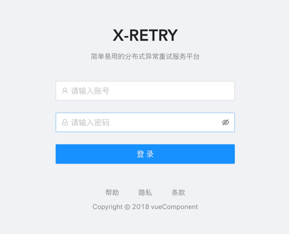

输入用户名: admin, 密码: 123456

## 仪表板
仪表盘直观展示系统的任务量、调度量、在线节点展示等
### 总任务量
统计当前系统总的任务量
#### 完成
已经调度成功的异常数据
#### 运行中
处于调度中的异常数据
#### 最大次数
调度次数超过配置的最大执行次数的异常数据

### 总调度量
展示系统触发调度的总数量
#### 失败
包括调度客户端执行失败、调度超时等异常执行的数据
#### 成功
调用客户端执行重试成功的数据

### 总在线机器
实时展示当前活跃的客户端与服务端

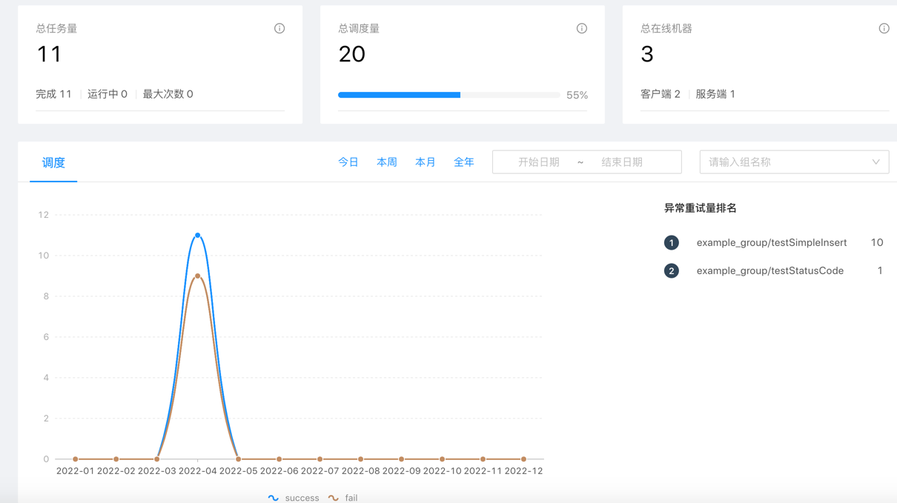


## 组配置
通过`新建`按钮配置点开配置组、场景、通知界面
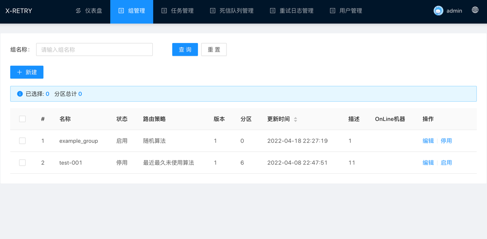

### 组配置
每个系统对应一个组，服务端通过一致性hash环来分配当前已启用的Group在集群中哪节点上消费

- 组名称: 名称是数字、字母、下划线组合，最长64个字符长度
- 状态: 开启/关闭, 通过状态开启或关闭组状态
- 路由策略: 随机算法、一致性hash算法、最近最久未使用算法
- 描述: 对组进行描述
- 指定分区: 不指定则系统随机分区，指定则使用指定的分区

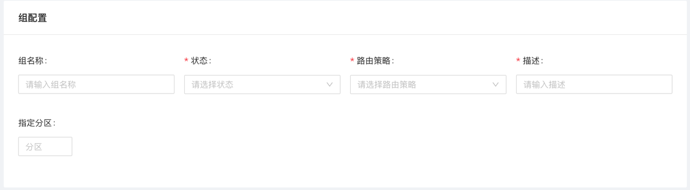

### 场景配置
场景负责管理收集重试现场的数据，比如 方法名、参数、类等信息; 对照代码 中可以理解为需要重试的方法;
每个业务服务对应N个场景值，即系统配置的最小单位。

- 场景名称: 名称是数字、字母、下划线组合，最长64个字符长度
- 场景状态: 开启/关闭, 通过状态开启或关闭场合状态
- 退避策略: 延迟等级、固定时间、CRON表达式、随机等待
- 最大重试次数: 重试上限值
- 描述: 对场景进行描述
- 操作: 新增-添加场景配置、删除-未提交则删除临时场景配置，已提交则删除数据库中的场景配置

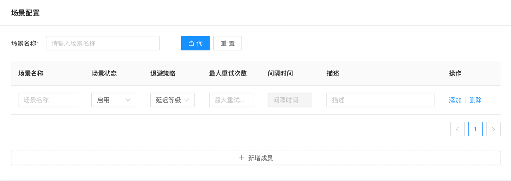

### 通知配置
及时告知系统管理人员，系统运行状态，如出现大量重试的数据、或者大量重试失败的数据

- 通知类型: 钉钉通知、邮箱通知、企业微信通知
- 通知场景: 
  - 重试数量超过阈值: 作用于服务端，重试中的数量到达阈值发送通知
  - 重试失败数量超过阈值: 作用于服务端，达到最大重试次数的数量到达阈值发送通知
  - 客户端上报失败: 作用于客户端，上报数据失败 发送 通知 
  - 客户端组件异常: 作用于客户端，重试组件内部异常，发送通知 
- 通知阈值: 到达阈值发送通知
- 通知地址: 发送通知的地址
- 描述: 对通知进行描述
- 操作: 新增-添加场景配置、删除-未提交则删除临时通知配置，已提交则删除数据库中的通知配置

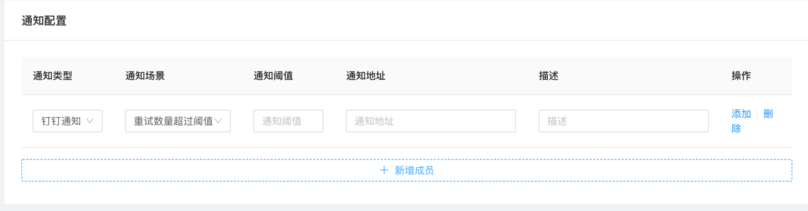

### 重试列表
查询当前处理重试中的数据，存在三种状态 
- 重试中: 会一直存在重试列表中
- 最大重试次数: 重试失败次数到达最大重试次数之后，由清除线程负责迁移至死信队列列表中
- 重试完成: 重试成功之后，由清除线程负责删除重试完成的数据

支持的搜索条件:
- 组名称: 下拉选择相应的组进行精确搜索
- 场景名称: 下拉选择相应的场景进行精确搜索
- 业务编号: 根据业务编号精确搜索
- 业务id: 根据业务id精确搜索

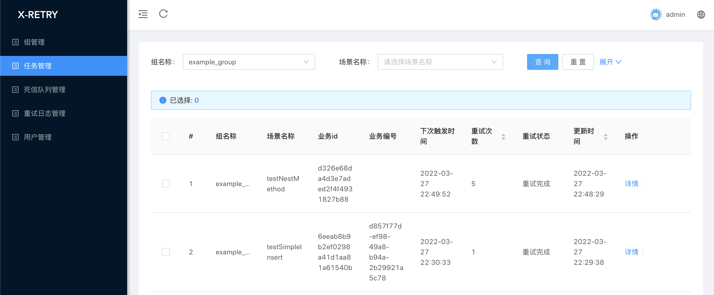

### 重试日志列表
支持的搜索条件:
- 组名称: 下拉选择相应的组进行精确搜索
- 场景名称: 下拉选择相应的场景进行精确搜索
- 业务编号: 根据业务编号精确搜索
- 业务id: 根据业务id精确搜索

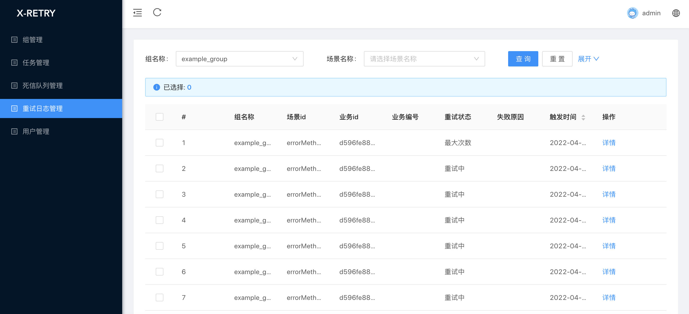

### 死信队列列表
支持的搜索条件:
- 组名称: 下拉选择相应的组进行精确搜索
- 场景名称: 下拉选择相应的场景进行精确搜索
- 业务编号: 根据业务编号精确搜索
- 业务id: 根据业务id精确搜索

#### 回滚
死信队列数据迁移至重试任务重，并删除死信队列数据

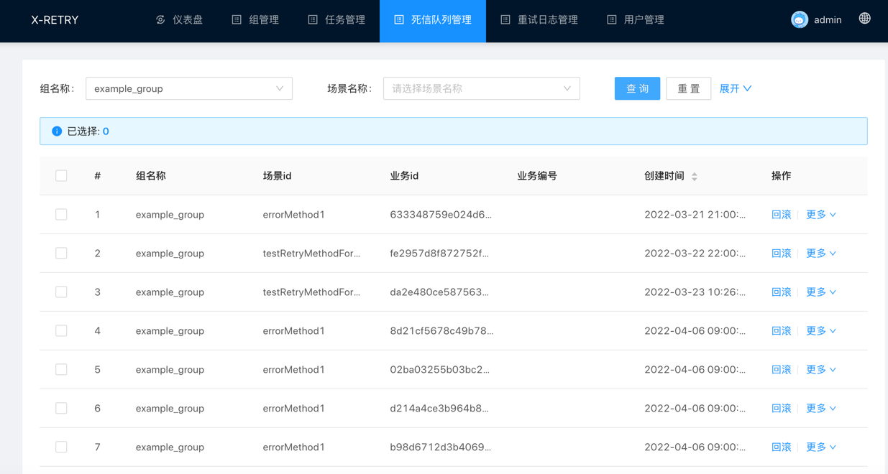

### 用户列表
搜索系统用户信息
支持的搜索条件:
- 用户名: 模糊搜索用户名


### 新增用户
为系统新增用户
- 用户名: 用户名是数字、字母、下划线组合，最长64个字符长度
- 密码: 密码是数字、字母、下划线组合，最长64个字符长度
- 角色: 
  - 普通用户: 负责分配的组权限
  - 管理员: 管理所有的 组谦虚
- 权限: 需要管理的组
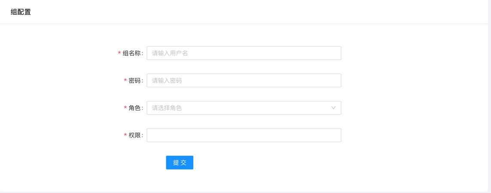
  
### 系统剖析
#### 客户端与服务端数据交互图
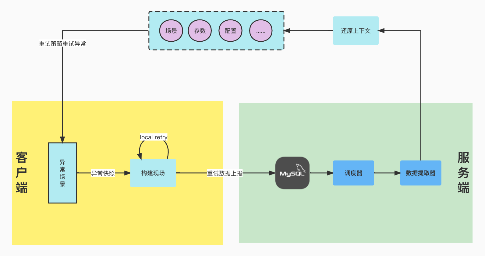

> 客户端核心能力
- 负责发现异常，标记事故现场
- 根据不同阶段进行本地重试和远程重试
- 失败上报和执行服务端下发的重试指令
- 避免服务间调用产生重试放大风险
- 重试流量管控
  - 单机多注解循环引用问题
  - 标记重试流量
  - 调用链超时控制(Deadline Request)
  - 特殊的 status code 限制链路重试

> 服务端核心能力
- 收集上报信息，统一预警
- 通过组协调器为不同的POD分配需要调度的Group信息
- 管理死信队列和重试数据状态以及触发时间
- 支持配置中心可视化

#### 系统架构图
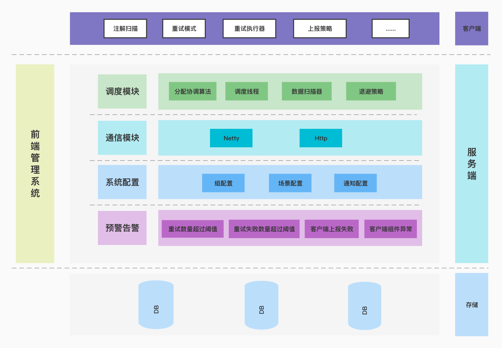

### 客户端剖析
#### 重试流量管控
> 单机重试管控

单机多注解嵌套方法,通过标记重试现场入口，发生异常重试只重试现场入口，防止每个方法都重试, 从而避免了重试风暴
   
> 链路重试管控

- 特殊的status code限制链路重试: 让被调用方有反抗的权利(统一约定一个特殊的 status code
它表示：调用失败，但别重试)
- 调用链超时控制(Deadline Request): 当剩余时间不够时不再发起重试请求
- 特殊的retry flag 保障重试请求不重试: 通请求头传递retry flag 保障即使发生异常也不重试

> 重试流速管控

通过路由策略和限流措施对每个组的集群进行流量控制

#### 支持多种退避策略
- 线性退避: 每次等待固定时间后重试
- 随机退避: 在一定范围内随机等待一个时间后重试
- 延迟等级退避: 依据延迟等级, 等待每个延迟等级设置的时间, 延迟等级枚举 `DelayLevelEnum`
- Cron表达式退避: 使用Cron表达式计算重试触发时间

#### 客户端功能模块图
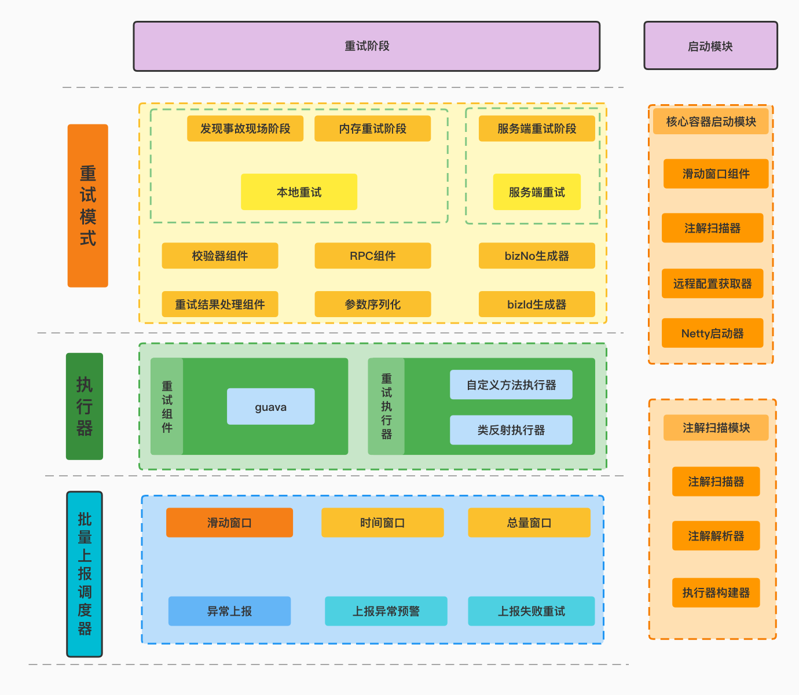

- 启动模块
  - 滑动窗口模块: 监听需要上报的数据
  - Netty启动器: 启动客户端Netty组件，建立与服务端心跳机制
  - 远程配置获取器: 获取最新版本的配置信息
  - 注解扫描模块: 负责扫描添加到方法上的@Retryable注解，获取参数信息、类信息、方法路径等；解析注解元数据信息，构建执行器
  
- 重试阶段  
  - 重试模式
    - 本地重试: 当发生异常时候, 若注解上的配置`RetryType.ONLY_LOCAL`或者`RetryType.LOCAL_REMOTE`, 则会触发本地内存重试
    - 远程重试: 本地重试没有成功，若注解上的配置`RetryType.ONLY_REMOTE`或者`RetryType.LOCAL_REMOTE`, 则会触发上报服务端重试

  - 执行器
    - 重试组件: 对guava retry 的深度封装
    - 重试执行器
       - 类反射执行器: 即重试执行原方法
       - 自定义方法执行器: 用户通过实现`RetryMethod`接口, 即可实现自定义重试, 发生重试时直接重试自定义方法执行器
- 重试流量管控
  - 单机多注解循环引用问题
   > 标记重试入口,触发重试时只从标记的重试入口进入
   
    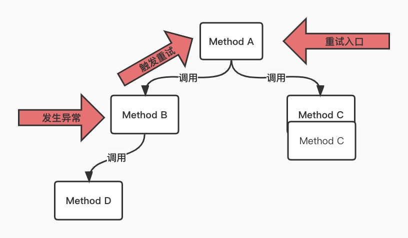
    
  - 标记重试流量
    > 对于重试的请求，我们在请求头中下发一个特殊的标识(xRetry:boolean), 
     在 Service A ->Service B ->Service C 的调用链路中，当Service B 收到Service A 的请求时会先读取这个 xRetry 判断这个请求是不是重试请求，
    如果是，那它调用Service C 即使失败也不会重试；否则将触发重试 。
    同时Service B 也会把这个 xRetry 下传，它发出的请求也会有这个标志，它的下游也不会再对这个请求重试
   
    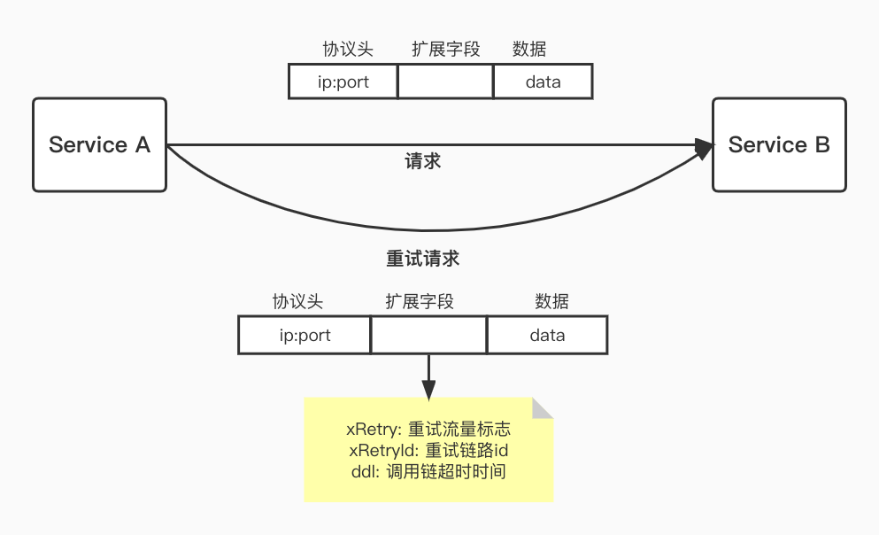
    
  - 调用链超时控制(Deadline Request)
    > DDL 是“ Deadline Request 调用链超时”的简称，我们知道 TCP/IP 协议中的 TTL 用于判断数据包在网络中的时间是否太长而应被丢弃，DDL 与之类似，
    它是一种全链路式的调用超时，可以用来判断当前的 RPC 请求是否还需要继续下去。如下图，在 RPC 请求调用链中会带上超时时间，
    并且每经过一层就减去该层处理的时间，如果剩下的时间已经小于等于 0 ，则可以不需要再请求下游，直接返回失败即可。
    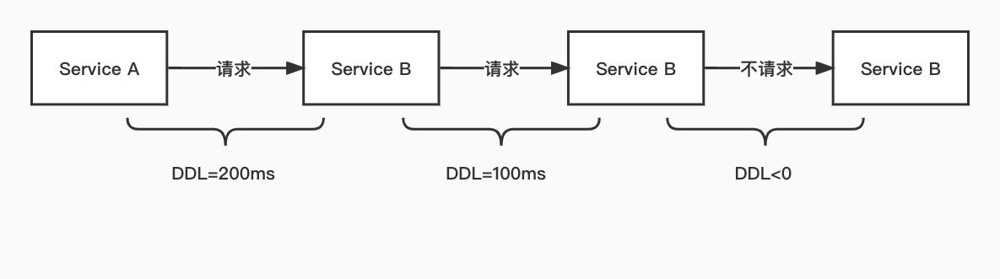
    
  - 特殊的 status code 限制链路重试
    > 如果每层都配置重试可能导致调用量指数级扩大，这样对底层服务来说压力是非常之大的, 通过对流量的标记
    ，用户可以判断是否是重试的流量来判断是否继续处理，我们使用 Google SRE 中提出的内部使用特殊错误码的方式来实现：
       
        1 统一约定一个特殊的 status code ，它表示：调用失败，但别重试。
        2 任何一级重试失败后，生成该 status code 并返回给上层。
        3 上层收到该 status code 后停止对这个下游的重试，并将错误码再传给自己的上层。
    
    > 这种方式理想情况下只有最下一层发生重试，它的上游收到错误码后都不会重试，但是这种策略依赖于业务方传递错误码，
    对业务代码有一定入侵，而且通常业务方的代码差异很大， 调用 RPC 的方式和场景也各不相同，需要业务方配合进行大量改造，
    很可能因为漏改等原因导致没有把从下游拿到的错误码传递给上游。
  
    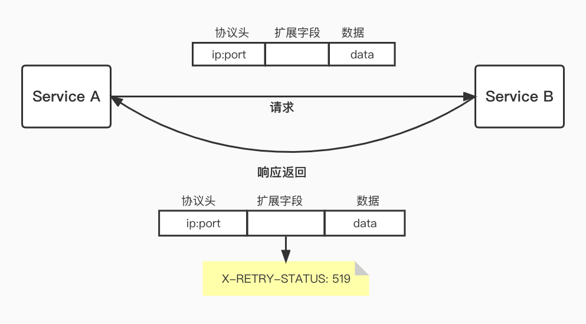
  
### 服务端剖析
#### 分布式调度模块

- master thread
  1. 扫描所有启用的组，通过客户端协调算法，分配当前节点需要重试的组
  2. 生成Actor,并扫描当前分配组下面所有待重试的数据

- 重试分发组件
  - ScanGroupActor
    1. 通过配置的时间范围扫描待重试数据
    2. 通过条件过滤器，过滤出满足条件的重试数据
  
  - ExecUnitActor
    1. 通过远程调用下发重试指令,
    2. 标记重试流量
  
  - 结果处理
    1. FailureActor: 处理重试失败数据，累加重试次数
    2. FinishActor: 处理重试成功数据并更新状态为重试成功
  
- 算法
  - 客户端轮询算法
    1. 一致性Hash算法
    2. LRU算法
    3. 随机算法
  - 服务端Rebalance算法
    1. 一致性hash 算法
  

  
  
  
  


