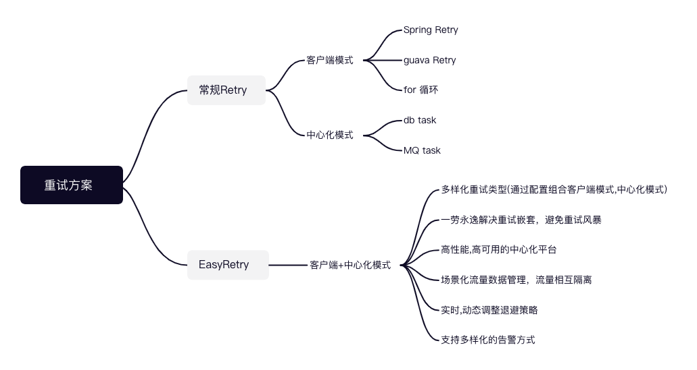

  

     🔥🔥🔥 灵活，可靠和快速的分布式任务重试和分布式任务调度平台   

> ✅️ 可重放，可管控、为提高分布式业务系统一致性的分布式任务重试平台  
> ✅️ 支持秒级、可中断、可编排的高性能分布式任务调度平台

# 🌸 简介
在当前广泛流行的分布式系统中，确保系统数据的一致性和正确性是一项重大挑战。为了解决分布式事务问题，涌现了许多理论和业务实践，其中BASE理论是目前业界广泛接受的分布式一致性理论。 
基于BASE理论，采用柔性事务并优先保障系统的可用性和数据的最终一致性已逐渐成为技术共识。 
为了确保分布式服务的可用性和数据一致性，并防止由于网络抖动、连接超时等问题导致短时不可用的情况，根据"墨菲定律"，在核心流程中增加重试和数据核对校验的动作成为提高系统鲁棒性常用的技术方案。 
在此背景下EasyRetry应运而生。EasyRetry是一款致力提高分布式业务系统一致性的分布式重试平台。它提供了控制台任务观测、可配置的重试策略、重试后执行回调以及丰富地告警配置等功能。通过这些手段，可以对异常数据进行全面监测和回放，从而在确保系统高可用性的同时，大大提升数据的一致性。 

# 🌼 重试方案对比

# 🍀 特性
snail-job 是一个针对业务系统重试流量的治理平台，其自身具有高可用高性能高负载的特点，服务特性有：
+ 支持千万级别的重试流量分派
+ 支持流量容量扩容，自动识别并处理
+ 支持流量处理节点水平扩容
+ 高效利用系统资源支持高并发
+ 支持多种算法调度客户端执行
+ 打包上报，支持高并发业务场景
+ 加密通讯，保障信息安全

# 🌺 业务场景
- https://www.easyretry.com/pages/406a68/

# 流量管理平台预览
地址: <http://preview.easyretry.com/snail-job/>
账号: developer
密码: 123456

## 特别用户

## 相关链接
- [字节跳动: 如何优雅地重试](https://juejin.cn/post/6914091859463634951)
- [这款分布式重试组件,治好了我的重试强迫症！](https://juejin.cn/post/7249607108043145274)
- [系统简介](https://www.easyretry.com/pages/d1d1da/)
- [架构与功能](https://www.easyretry.com/pages/540554/)

## 原理
- [场景应用](https://www.easyretry.com/pages/406a68/)
- [HelloWorld](https://www.easyretry.com/pages/da9ecc/)

## 应用实例
- [snail-job-demo](https://gitee.com/byteblogs168/snail-job-demo.git)

## 期望
欢迎提出更好的意见，帮助完善 snail-job

## 版权
[Apache-2.0](https://gitee.com/aizuda/snail-job/blob/master/LICENSE)
